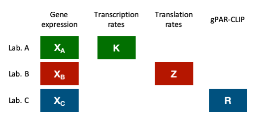
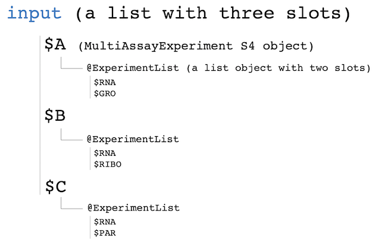
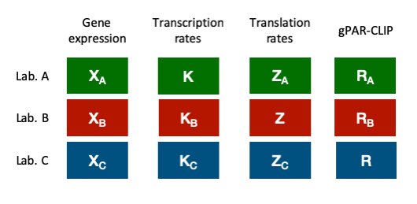

<style>
body {
text-align: justify}
</style>


```{r setup, include=FALSE}
knitr::opts_chunk$set(echo = TRUE, fig.width = 7, fig.height = 5)
```

# 1. Introduction

Diversity of omic technologies has expanded in the last years together with the number of omic data integration strategies. However, multiomics data generation is costly and many research groups cannot afford research projects where many different omics techniques are generated, at least at the same time. As most researchers share their data in public repositories, different omic datasets of the same biological system obtained at different labs can be combined to construct a multiomic study. However, data obtained at different labs or moments in time are typically subjected to batch effects that need to be removed for successful data integration. While there are methods to correct batch effects on the same data types obtained in different studies, they cannot be applied to correct lab or batch effects across omics. This impairs multiomics meta-analysis. Fortunately, in many cases, at least one omics platform –i.e. gene expression- is repeatedly measured across labs, together with the additional omics modalities that are specific to each study. This creates an opportunity for batch analysis. We have developed MultiBaC, a strategy to correct batch effects from multiomic datasets distributed across different labs or data acquisition events. Our strategy is based on the existence of at least one shared data type which allows data prediction across omics. We validate this approach both on simulated data and on a case where the multiomics design is fully shared by two labs, hence batch correction within the same omics modality using traditional methods can be compared with the MultiBaC correction across data types. Finally we apply MultiBac to a true multiomics data integration problem to show that we are able to improve the detection of meaningful biological effects.

# 2. Input Data:

MultiBaC package contsins example datasets called "multiyeast". We collected data from Gene Expression Omnibus (GEO) database pertaining to three different studies that analyzed the effects of glucose starvation in yeast. These studies used equivalent yeast strains and experimental conditions, but differed in the types of omics technologies profiled. Lab A (Department of Biochemistry and Molecular Biology, Universitat de València) collected gene expression (RNA, with accession number GSE11521) and transcription rates (GRO, with accession number GSE1002) [@JE1][@JE2][@JE3]. Lab B (Department of Molecular and Cellular Biology, Harvard University), obtained gene expression (RNA) and translation rates (RIBO), with accession number GSE56622 [@RIBO]. Finally, Lab C (Department of Biology, Johns Hopkins University), measured gene expression (RNA) and global PAR-CLIP data (PAR-CLIP) accession number GSE43747 [@PARCLIP]. Therefore, labs had one shared (RNA) and one distinct (GRO, RIBO and PAR-CLIP, respectively) data types. This distributed multiomics scenario represents the type of correction problem MultiBaC addresses. A scheme of the data structure is shown in Figure 1.




```{r, include=TRUE}
library(MultiBaC)
data(multiyeast)
```

Up to six matrices are loaded. The initial capital letter is the study followed by the omic name in lower case. MultiBaC requires a list of *MultiAssayExperiment* [@MAE] objects which is the bioconductor container for multiomic studies. As Bioconductor recomends, we use MultiAssayExperiment object type to store multi omics studies. Hence, the input of MultiBaC is a list of MultiAssayExperiment objects. The package contains a function to built the input object from a set of matrices or data.frame objects. The correct orientation for input matrices is features x samples. The following example shows part of the expression data for study A:

```{r, include=TRUE}
head(A.rna)
```

In order to pack the matrices in a MultiAssayExperiment object, we have implemented inputData function. An example on how it works is shown below:

```{r, include=TRUE}
input <- inputData (A.rna, A.gro, B.rna, B.ribo, C.rna, C.par, 
                    batches = c(1,1,2,2,3,3),
                    omicNames = c("RNA", "GRO", "RNA", "RIBO", "RNA", "PAR"), 
                    batchesNames = c("A", "B", "C"))
```

The inputData function can incorporate as many omic matrices as needed. Furthermore, the function has three mandatory arguments: batches, omicNames and batchesNames. 

+ batches: Could be a class vector or factor object. It must indicate which input matrices belong to the same study or lab.
+ omicNames: Contains the names of each input matrix. 
+ batchesNames: The function returns a list with as many slots as number of batches. This vector contains the name of each batch which are the names of the different slots of the returned list.

*input* object generated is a list with the structure showed in Figure 2.



Once input object is created, MultiBaC function can be performed. 

# 3. Batch exploration

First of all, it is possible to measure the batch magnitude in our data in order to previse MultiBaC performance. We are able to do it using *batchEstPlot()* function.

```{r, include=TRUE}
batchEstPlot(input, commonOmic = 1)
```

The plot generated shows three different different levels of theoretical batch effect magnitude (low, moderate and high). Moreover, in this case all omics are meausered at gene level and they can be merge into a global matrix to perform a PCA analysis with all of them together. PCA analysis is performed using *opls()* function from ropls[@ropls] package available at Bioconductor.

```{r, include = TRUE}
# Create a global matrix
inData <- t(cbind(A.rna, B.rna, C.rna, A.gro, B.ribo, C.par))

# Generate PCA analysis
pc <- ropls::opls(inData, predI = 2, scaleC = "center", 
                  fig.pdfC = NULL, info.txtC = NULL)

# Plot PCA
{mypar <- par(no.readonly = TRUE)
  mai <- c(par()$mai[1:3],par()$pin[2]-0.2)
  par(mfrow= c(1,1), xpd = TRUE, mai = mai)}
  
plot(pc@scoreMN,
     xlab = paste0("PC 1: ",
                   pc@modelDF$`R2X(cum)`[1]*100, " %"),
     ylab = paste0("PC 2: ",
                   pc@modelDF$`R2X(cum)`[2]*100, " %"),
     # pch = omic; fill = condition
     pch = c(19,19,19,1,1,1,19,19,1,1,19,19,1,1, # RNA
             15,15,15,0,0,0, # GRO
             17,17,2,2, # RIBO
             18,18,5,5),# PAR
     # col = batch
     col = rep(c(rep("brown", 6),
                 rep("dodgerblue2", 4),
                 rep("forestgreen", 4)),2),
     # other arguments
     asp = 1, cex.axis = 1.3, cex.lab = 1.2, cex = 1.7, bty = "L",
     main = "Scoreplot of corrected data sets", cex.main = 1.7,
     xlim = c(-30, 40), ylim = c(-20,20), font.lab = 2)
abline(v = 0, lty = 5, col = "gray", xpd = FALSE)
abline(h = 0, lty = 5, col = "gray", xpd = FALSE)
legend(60,40, legend = c("Shape: Omic",
                             "RNA", "GRO", "RIBO", "PAR",
                             "Fill: Condition",
                             "Glu +", "Glu -",
                             "Color: Batch",
                             "Batch A", "Batch B", "Batch C"),
       col = c("white", rep(1, 4),
               "white", 1, 1,
               "white", "brown", "dodgerblue2", "forestgreen"),
       pch = c(0, 19, 15, 17, 18,
               0, 19, 1,
               0, 15, 15, 15), cex = 1.4, bty = "n")
```

Of course, batch effect is only appreciable in RNA data (dots in figure), since it is measured in every batch. RNA data is separated according to the batch effect and their respective omics are close to them according to the batch too.

# 4. MultiBaC correction:

Before applying MultiBaC function, it is neccessary to create the *cond.factor* argument. This is a list containing the common experimental design across batches:

```{r, include=TRUE}
cond.factor = list("A" = c("Glu+", "Glu+", "Glu+", "Glu-", "Glu-", "Glu+"),
                   "B" = c("Glu+", "Glu+", "Glu-", "Glu-"),
                   "C" = c("Glu+", "Glu+", "Glu-", "Glu-"))
```


Now, we can apply MultiBaC:

```{r, include=TRUE}
res <- MultiBaC(input, test.comp = 5, cond.factor = cond.factor,
                showplot = TRUE)
```

The output object has the same structure than the input element. Since showplot argument is equal to TRUE, $Q^2$ and explained variance plots are shown. $Q^2$ indicates the prediction capacity of each PLS model. MultiBaC function is conceived to select the optimal number of components that optimize $Q^2$ in each model. As for the explained variance plot, it shows the number of components ARSyN needs to optimize the batch effect estimation and in turn to optimize the batch correction.
In order to see the performance, we can repeat the PCA plot using corrected data.

```{r, include=TRUE}
# Extract corrected matrices
A.rnacor <- res$A@ExperimentList$RNA
B.rnacor <- res$B@ExperimentList$RNA
C.rnacor <- res$C@ExperimentList$RNA
A.grocor <- res$A@ExperimentList$GRO
B.ribocor <- res$B@ExperimentList$RIBO
C.parcor <- res$C@ExperimentList$PAR

# Create a global matrix
outData <- t(cbind(A.rnacor, B.rnacor, C.rnacor, A.grocor, B.ribocor, C.parcor))

# Generate PCA analysis
pc <- ropls::opls(outData, predI = 2, scaleC = "center", plotL = FALSE, printL = FALSE)

# Plot PCA
{mypar <- par(no.readonly = TRUE)
  mai <- c(par()$mai[1:3],par()$pin[2]-0.2)
  par(mfrow= c(1,1), xpd = TRUE, mai = mai)}

plot(pc@scoreMN,
     xlab = paste0("PC 1: ",
                   pc@modelDF$`R2X(cum)`[1]*100, " %"),
     ylab = paste0("PC 2: ",
                   pc@modelDF$`R2X(cum)`[2]*100, " %"),
     # pch = omic; fill = condition
     pch = c(19,19,19,1,1,1,19,19,1,1,19,19,1,1, # RNA
             15,15,15,0,0,0, # GRO
             17,17,2,2, # RIBO
             18,18,5,5),# PAR
     # col = batch
     col = rep(c(rep("brown", 6),
                 rep("dodgerblue2", 4),
                 rep("forestgreen", 4)),2),
     # other arguments
     asp = 1, cex.axis = 1.3, cex.lab = 1.2, cex = 1.7, bty = "L",
     main = "Scoreplot of corrected data sets", cex.main = 1.7,
     xlim = c(-30, 40), ylim = c(-30,40))
abline(v = 0, lty = 5, col = "gray", xpd = FALSE)
abline(h = 0, lty = 5, col = "gray", xpd = FALSE)
legend(60,40, legend = c("Shape: Omic",
                             "RNA", "GRO", "RIBO", "PAR",
                             "Fill: Condition",
                             "Glu +", "Glu -",
                             "Color: Batch",
                             "Batch A", "Batch B", "Batch C"),
       col = c("white", rep(1, 4),
               "white", 1, 1,
               "white", "brown", "dodgerblue2", "forestgreen"),
       pch = c(0, 19, 15, 17, 18,
               0, 19, 1,
               0, 15, 15, 15), cex = 1.4, bty = "n")
```
Again, the batch correction is only appreciable in RNA data. Now RNA data are displayed together in the PCA which means that batch effect has been removed. The positions of the rest of the omics have also changed and they are not close to their respective RNA data, hence omic relations are more reliable.

# 5. Performing MultiBaC by individual modules.

MultiBaC is created using modules, in such a way that we are able to repeat the whole process but running separated steps.

## a. Creating models:

In this step we create PLS models for each batch. The number of PLS models for a certain batch depends on how many non-common omics it contains. In this case each batch contains only one non-coomon omic, thus only one PLS model is generated for each batch.

```{r, include=TRUE}
modelList <- genModelList(input, test.comp = 5)$modelList
```

## b. Generate missing omics:

The second step consists on predicting the missing omics, i.e. for each batch, the omics it had not originally are predicted. The output structure is showed in Figure 3. 

```{r, include=TRUE}
missingOmics <- genMissingOmics(input, modelList, commonOmic = 1)
```



## c. Batch correction:

The last step is the batch correction per omic. ARSyN method [@Nueda2012] is applied for each omic using the original and the predicted data.

```{r, include=TRUE}
res <- batchCorrection(missingOmics, cond.factor)$correctedOmics
res$A
```

The slot of each batch contains all the omics: corrected and predicted, e.g. res$A contains RNA, GRO, RIBO and PAR, however, only RNA and GRO are corrected omics for batch A. RIBO and PAR are the predicted omics for batch A that are only used to correct RIBO for batch B and PAR for lab C. Since the are predicted values that were originally missing, they should not be used for further analysis. 


# References:
